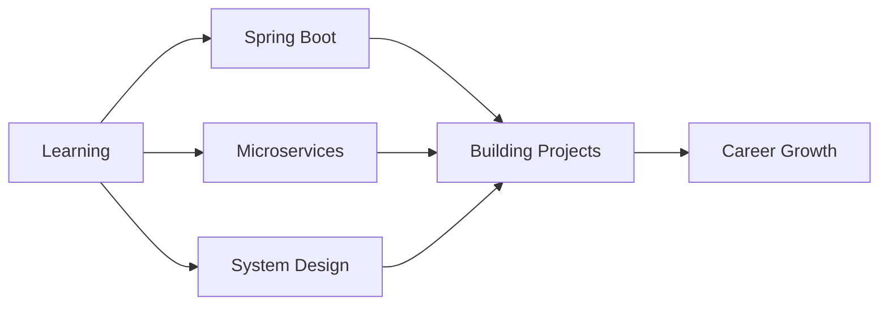

<div align="center">
  
# 👨‍💻 Ahmed Hussen

### Backend Developer | Java Spring Boot Trainee | AI Enthusiast

[](https://www.linkedin.com/in/ahmed-elsherif-119b60337)
[](https://codeforces.com/profile/ahmed452005)
[](https://youtube.com/@ahmedhussen8077?si=LwLCuFNhZRdNkLLK)


</div>

---

## 🚀 About Me

```java
public class AhmedHussen extends Developer {
    
    private String currentFocus = "Building scalable backend systems with Spring Boot";
    private String[] passions = {"Clean Code", "System Design", "Problem Solving"};
    private String learningGoal = "Mastering enterprise-level Java applications";
    
    @Override
    public void code() {
        while (alive) {
            eat();
            sleep();
            code();
            repeat();
        }
    }
}
```

- 🎓 **Computer Science enthusiast** with a passion for backend architecture
- 🔭 Currently training in **Java Spring Boot** and building production-ready applications
- 🧠 Strong believer in **clean code**, **SOLID principles**, and **design patterns**
- 🌱 Exploring **microservices**, **cloud technologies**, and **distributed systems**
- 💬 Ask me about **backend development**, **algorithms**, or **system design**

---

## 🛠️ Tech Stack

### Languages
<p>
  
  
  
  
</p>

### Backend & Frameworks
<p>
  
  
  
</p>

### Data & Analytics
<p>
  
  
  
  
</p>

### Core Expertise
<p>
  
  
  
  
  
  
</p>

### Tools & Platforms
<p>
  
  
  
  
  
</p>

---

## 📊 GitHub Statistics

<div align="center">
  
  
</div>

<div align="center">
  
</div>

---


<!-- <div align="center">
  
[](https://codeforces.com/profile/ahmed452005) -->

</div>


## 🎯 Current Focus



- 🔨 Building real-world projects with **Spring Boot**
- 📚 Deep diving into **Spring Security** and **Spring Data JPA**
- 🧩 Solving problems on **Codeforces** to keep algorithms sharp
- 🎓 Learning **system design** patterns for scalable applications
- 🚀 Exploring **containerization** with Docker

---

## 💼 What I'm Looking For

- 🤝 Open to **collaboration** on interesting backend projects
- 💡 Always eager to learn from experienced developers
- 🎯 Seeking opportunities to work on **production-level applications**
- 📈 Building my portfolio with **meaningful projects**

---

## 📫 Let's Connect!

<div align="center">

[](https://www.linkedin.com/in/ahmed-elsherif-119b60337)
[](https://www.facebook.com/share/1KscghQWsa/?mibextid=LQQJ4d)
[](https://youtube.com/@ahmedhussen8077?si=LwLCuFNhZRdNkLLK)
[](https://codeforces.com/profile/ahmed452005)

### 💬 *"Clean code always looks like it was written by someone who cares."* - Robert C. Martin

</div>

---

<div align="center">
  
### ⭐ If you like my work, consider giving a star to my repositories!

**Happy Coding! 🚀**

</div>
